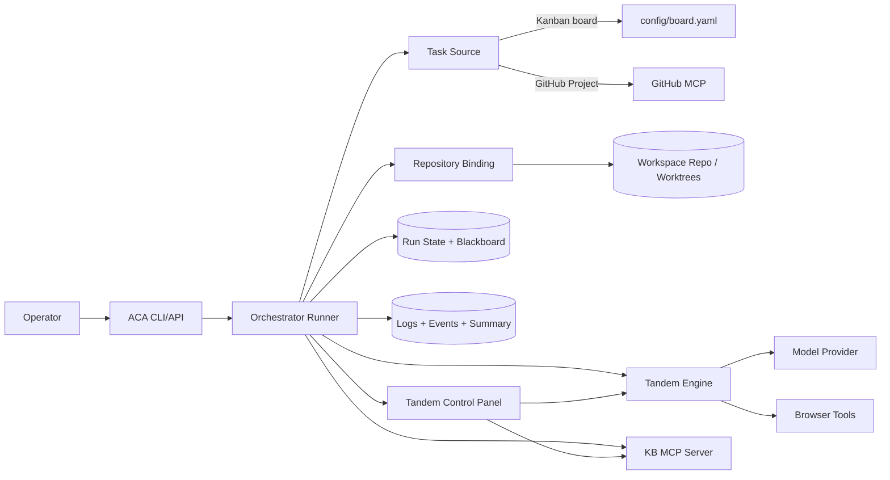
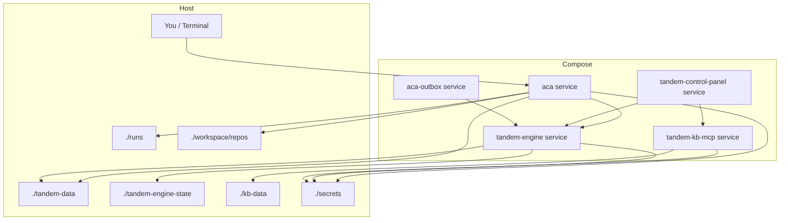
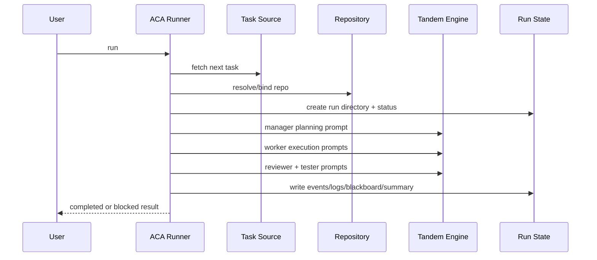

<p align="center">
  
</p>

<p align="center">
  <a href="README.md">English</a> | <a href="README.zh-CN.md">简体中文</a>
</p>

**Tandem Agents** is a self-contained runnable Tandem agent stack. It brings
the Tandem engine, control panel, ACA autonomous coding runtime, KB MCP server,
and local orchestration scripts into one repo so developers can inspect, run,
and test the system without depending on Tandem's internal hosted deployment.

The included **ACA** (Autonomous Coding Agent) runtime runs a repeatable
software-delivery loop:

- pick the next task from a board or GitHub Project
- bind that work to the correct repository and workspace
- run a governed manager/worker/reviewer/tester delivery loop
- leave behind a durable execution trail with status, logs, diffs, artifacts, and a coordination ledger
- optionally ship the result as a branch and pull request

It is designed to run the same way on a laptop, in Docker Compose, or on a
hosted Linux box.

> **Naming.** This project was previously published as **ACA**. The repo,
> Python package (`tandem_agents`), and Compose project name are now
> "Tandem Agents" because the project contains the broader Tandem runtime
> stack. The coding agent itself is still **ACA**: the CLI is `aca`, the
> Compose service is `aca`, the agent's MCP server is `ac.tandem/aca-mcp`,
> and the agent's git artifacts still use the `aca/` and `aca:` prefixes.

## What Is Included

- Tandem engine sidecar for durable workflow execution and provider access
- Tandem control panel for local setup, status, and operator controls
- ACA runtime for governed coding tasks against local boards or GitHub Projects
- KB MCP server for knowledge-base backed agent context
- Docker Compose topology, setup scripts, local config templates, and run docs

## What Tandem Changes

Tandem Agents is not just a coding demo or a thin wrapper around prompting. It
is an operator-controlled execution system for real software work: take a task
from a real source, bind it to the correct repository, run a bounded coding
workflow, and leave behind a durable record of what happened.

- It turns one-off prompting into a durable execution system with task intake, repository binding, orchestration, validation, and run output.
- It emphasizes deterministic control points over "agent vibes": explicit task selection, explicit repo binding, explicit provider/model selection, explicit run phases, and explicit artifacts.
- It bakes governance into the loop through board state, blackboard coordination, status snapshots, validation phases, and auditable summaries of each run.
- It keeps task selection separate from code execution, so the same runner can work from a local board, a GitHub Project, or a direct operator prompt.
- It makes repository scope explicit instead of assuming the current folder is the correct place to edit.
- It records status, blackboard state, logs, summaries, diffs, and artifacts so each run leaves a usable handoff trail.
- It records a durable coordination ledger for tasks, leases, runs, workers, and outbox events so claims and sync-back can be recovered.
- It lets you swap providers, models, and execution backends without rewriting the workflow itself.
- It supports bounded multi-agent work and browser-assisted QA when the task needs them, without making that complexity mandatory for every run.

## Why The Engine Matters

ACA is built on Tandem so orchestration lives in durable engine state instead of being improvised inside a prompt thread.

- Tandem gives ACA an engine-owned state model, so coordination survives across phases, workers, restarts, and monitoring sessions.
- Tandem exposes governance-friendly primitives such as shared run state, task claiming, approvals, replayable events, and backend-managed execution.
- Tandem keeps provider and model access behind a stable engine layer, which makes ACA more portable, inspectable, and auditable.
- Tandem makes bounded multi-agent work more deterministic because workers coordinate through materialized runtime state instead of implicit conversational context.

That Tandem foundation is a major reason ACA can aim for real-world coding operations with stronger determinism and governance than prompt-only agents.

## Architecture



## Runtime Topology (Docker Compose)



## Execution Flow



## Quick Start

For the full first-time local path, start with
[docs/LOCAL_QUICKSTART.md](docs/LOCAL_QUICKSTART.md).

1. Read [AGENTS.md](AGENTS.md).
2. Create runtime config and bootstrap the control-panel config:

```bash
cp .env.example .env
./scripts/setup.sh
```

The setup step prints the Tandem token you use to sign in to the control panel.

3. Validate config:

```bash
./scripts/run.sh --print-config
./scripts/run.sh --validate
```

4. Start stack:

```bash
./scripts/build-containers.sh
```

By default, container builds install the latest Tandem engine and control panel releases.
If you want to pin a specific release for repeatable testing, set `TANDEM_ENGINE_RELEASE_VERSION` and/or `TANDEM_CONTROL_PANEL_RELEASE_VERSION` in `.env` or in your shell before rebuilding. `TANDEM_RELEASE_VERSION` still pins both packages for older configs:

```bash
export TANDEM_ENGINE_RELEASE_VERSION=<specific-engine-release>
export TANDEM_CONTROL_PANEL_RELEASE_VERSION=<specific-panel-release>
./scripts/build-containers.sh
```

For a full refresh of the whole stack:

```bash
docker compose down
docker compose up -d --build
```

5. Run one task:

```bash
docker compose exec aca python3 -m src.tandem_agents.cli run
```

6. Watch the run:

```bash
./scripts/monitor.sh
docker compose exec aca python3 -m src.tandem_agents.cli monitor --follow
```

## Services And Ports

- `tandem-engine` runs inside Compose and is consumed by ACA and control panel.
- `tandem-control-panel` is exposed on `${TANDEM_CONTROL_PANEL_PORT:-39734}`.
- `aca` API mode is exposed on `${ACA_API_PORT:-39735}`.
- `tandem-kb-mcp` is bound to localhost on `${KB_PORT:-39736}`.

If `39734` or `39735` is already in use, change the corresponding values in `.env`.

## Common Workflows

### Run ACA Against A GitHub Project

- Configure GitHub Project intake in the control panel Install settings.
- Provide `GITHUB_PERSONAL_ACCESS_TOKEN` (or `GITHUB_TOKEN`) in `.env` if you want Tandem's built-in GitHub MCP bootstrap to work non-interactively.
- Start stack and run `docker compose exec aca python3 -m src.tandem_agents.cli run`.

### Run ACA Against A Local Board

- Keep tasks in `config/board.yaml` or set the local board path in the control panel Install settings.
- Point repo binding at your mounted repo path through the control panel Install settings.

### Browser QA Smoke Test

```bash
docker compose exec aca python3 scripts/test_browser.py https://frumu.ai
```

Screenshot artifacts are written under:

- engine container path: `/home/node/.local/share/tandem/data/browser-artifacts/...`
- host path: `./tandem-engine-state/data/browser-artifacts/...`

## Key Paths

- orchestration code: `src/tandem_agents/core/`
- CLI/API entry points: `src/tandem_agents/cli/` and `src/tandem_agents/api/`
- runtime state writers: `src/tandem_agents/runtime/`
- setup + launch scripts: `scripts/`
- container definitions: `docker-compose.yml`, `config/Dockerfile*`
- docs index: [docs/README.md](docs/README.md)

## Security And Safety

- Local secrets and generated state are not tracked (`.env`, `secrets/*`, `tandem-data/`, `artifact-store/`, run artifacts).
- Git hooks are included for leak checks (`.githooks/pre-commit`, `.githooks/pre-push`).
- Run `bash scripts/setup-githooks.sh` once per clone to enable hooks.

## License

This project is licensed under [Business Source License 1.1](LICENSE).

- non-production use is allowed
- limited internal production evaluation is allowed under the Additional Use Grant in LICENSE
- continued production or broader commercial use requires a separate commercial license

For commercial terms, see [COMMERCIAL_LICENSE.md](COMMERCIAL_LICENSE.md) or contact info@frumu.ai.
For dependency notices and asset/trademark boundaries, see
[THIRD_PARTY_NOTICES.md](THIRD_PARTY_NOTICES.md).

## Recommended Read Order

1. [AGENTS.md](AGENTS.md)
2. [docs/LOCAL_QUICKSTART.md](docs/LOCAL_QUICKSTART.md)
3. [docs/README.md](docs/README.md)
4. [docs/DOCKER_COMPOSE.md](docs/DOCKER_COMPOSE.md)
5. [docs/CONFIG_SCHEMA.md](docs/CONFIG_SCHEMA.md)
6. [docs/RUN_STATE_SCHEMA.md](docs/RUN_STATE_SCHEMA.md)
