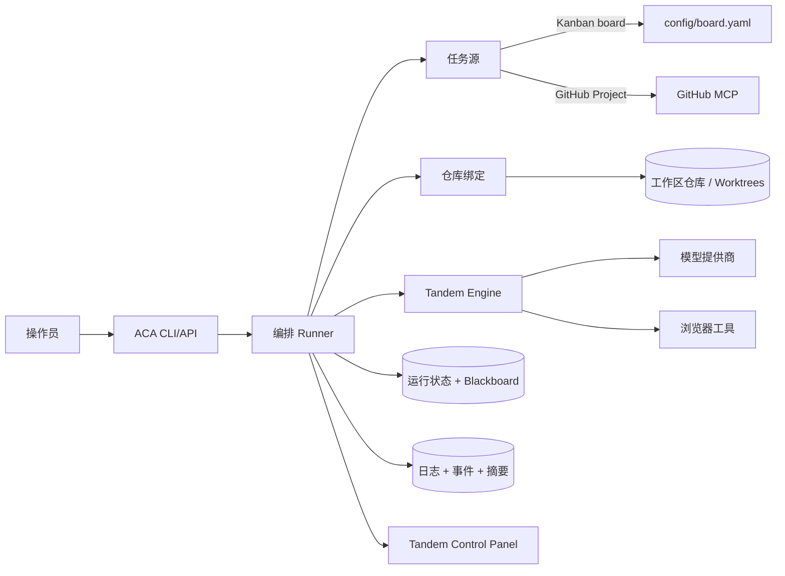
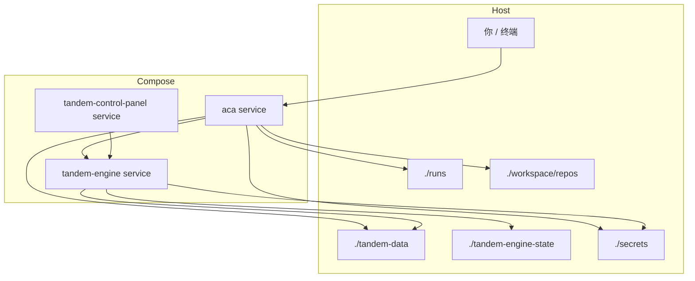
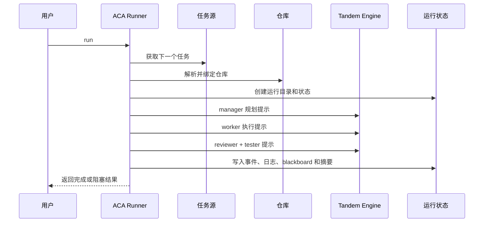

<p align="center">
  
</p>

<p align="center">
  <a href="README.md">English</a> | <a href="README.zh-CN.md">简体中文</a>
</p>

Tandem ACA（Autonomous Coding Agent，自主编码代理）是一个自主编码控制平面，用于运行可重复的软件交付流程：

- 从看板或 GitHub Project 中选择下一个任务
- 将该任务绑定到正确的代码仓库和工作区
- 运行受治理的 manager/worker/reviewer/tester 交付循环
- 留下包含状态、日志、diff 和产物的持久执行轨迹
- 可选地将结果以分支和 pull request 的形式交付

它被设计为可以在笔记本电脑、Docker Compose 环境或托管 Linux 主机上以相同方式运行。

ACA 构建在 [Tandem](https://github.com/frumu-ai/tandem) 之上。Tandem 是我们开发的工作流引擎，作为 ACA 的持久运行时基础：它提供引擎拥有的状态、协调原语、与模型提供商无关的执行层，以及后端 API，使 ACA 能够运行受治理的编码工作流，而不必把聊天记录当作事实来源。

## ACA 带来的变化

ACA 不只是一个编码演示，也不是对提示词的轻量封装。它是一个面向真实软件工作的、由操作员控制的执行系统：从真实任务源接收任务，绑定到正确仓库，运行有边界的编码工作流，并留下清晰、可追溯的执行记录。

- 它把一次性提示交互升级为具备任务接入、仓库绑定、编排、校验和运行输出的持久执行系统。
- 它强调确定性的控制点，而不是“代理凭感觉工作”：显式任务选择、显式仓库绑定、显式 provider/model 选择、显式运行阶段和显式产物。
- 它通过看板状态、blackboard 协调、状态快照、验证阶段和可审计摘要，把治理能力内建到执行循环中。
- 它将任务选择与代码执行分离，因此同一个 runner 可以处理本地看板、GitHub Project 或操作员直接输入的任务。
- 它明确仓库范围，而不是假设当前目录就是应该修改的地方。
- 它记录状态、blackboard 状态、日志、摘要、diff 和产物，因此每次运行都会留下可交接的结果。
- 它支持在不重写工作流的情况下替换 provider、model 和执行后端。
- 当任务需要时，它支持有边界的多代理协作和浏览器辅助 QA，而不会把这些复杂度强加给每一次运行。

## 为什么 Tandem 很重要

ACA 构建在 Tandem 上，因此编排逻辑存在于持久化的引擎状态中，而不是临时拼接在提示线程里。

- Tandem 为 ACA 提供引擎拥有的状态模型，因此协调可以跨阶段、跨 worker、跨重启和跨监控会话持续存在。
- Tandem 提供适合治理的原语，例如共享运行状态、任务认领、审批和可重放事件，以及后端管理的执行能力。
- Tandem 将 provider 与 model 的访问封装在稳定的引擎层之后，使 ACA 更具可移植性、可检查性和可审计性。
- Tandem 让有边界的多代理协作更具确定性，因为 worker 通过具体化的运行时状态协调，而不是依赖隐式的会话上下文。

正是基于 Tandem，ACA 才能以比纯提示代理更强的确定性和治理能力，面向真实世界的软件交付场景。

## 架构



## 运行时拓扑（Docker Compose）



## 执行流程



## 快速开始

1. 阅读 [AGENTS.md](AGENTS.md)。
2. 创建运行时配置：

```bash
cp .env.example .env
./scripts/setup.sh
```

3. 验证配置：

```bash
./scripts/run.sh --print-config
./scripts/run.sh --validate
```

4. 启动整套服务：

```bash
./scripts/build-containers.sh
```

默认情况下，容器构建会安装最新的 Tandem engine 和 control panel 版本。
如果你想锁定某个特定版本以便重复测试，请先在 `.env` 或当前 shell 中设置 `TANDEM_ENGINE_RELEASE_VERSION` 和/或 `TANDEM_CONTROL_PANEL_RELEASE_VERSION`，然后重建并重启对应容器。`TANDEM_RELEASE_VERSION` 仍可作为旧配置的兼容选项，同时锁定两个包：

```bash
export TANDEM_ENGINE_RELEASE_VERSION=<specific-engine-release>
export TANDEM_CONTROL_PANEL_RELEASE_VERSION=<specific-panel-release>
./scripts/build-containers.sh
```

如果要完整刷新整套服务：

```bash
docker compose down
docker compose up -d --build
```

5. 运行一个任务：

```bash
docker compose exec aca python3 -m src.aca.cli.cli run
```

6. 观察运行状态：

```bash
./scripts/monitor.sh
docker compose exec aca python3 -m src.aca.cli.cli monitor --follow
```

## 服务与端口

- `tandem-engine` 运行在 Compose 内部，供 ACA 和 control panel 使用。
- `tandem-control-panel` 默认暴露在 `${TANDEM_CONTROL_PANEL_PORT:-39734}`。
- `aca` API 模式默认暴露在 `${ACA_API_PORT:-39735}`。

如果 `39734` 或 `39735` 已被占用，请在 `.env` 中修改对应值。

## 常见工作流

### 让 ACA 处理 GitHub Project

- 通过 `./scripts/setup.sh` 在 `.env` 中配置 GitHub 任务源。
- 在 `.env` 中提供 `GITHUB_PERSONAL_ACCESS_TOKEN`（或 `GITHUB_TOKEN`）。
- 启动服务后运行 `docker compose exec aca python3 -m src.aca.cli.cli run`。

### 让 ACA 处理本地看板

- 使用 `ACA_TASK_SOURCE_TYPE=kanban_board`。
- 将任务保存在 `config/board.yaml` 中。
- 将仓库绑定指向你挂载的仓库路径。

### 浏览器 QA 冒烟测试

```bash
docker compose exec aca python3 scripts/test_browser.py https://frumu.ai
```

截图产物会写入：

- 引擎容器内路径：`/home/node/.local/share/tandem/data/browser-artifacts/...`
- 主机路径：`./tandem-engine-state/data/browser-artifacts/...`

## 关键路径

- 编排代码：`src/aca/core/`
- CLI/API 入口：`src/aca/cli/` 和 `src/aca/api/`
- 运行时状态写入：`src/aca/runtime/`
- setup 和启动脚本：`scripts/`
- 容器定义：`docker-compose.yml`、`config/Dockerfile*`
- 文档索引：[docs/README.md](docs/README.md)

## 安全性

- 本地 secrets 不会被纳入版本管理（`.env`、`secrets/*`、`tandem-data/`、运行产物）。
- 仓库中包含用于泄漏检查的 Git hooks（`.githooks/pre-commit`、`.githooks/pre-push`）。
- 每次克隆后运行一次 `bash scripts/setup-githooks.sh` 以启用 hooks。

## 许可证

本项目基于 [Business Source License 1.1](LICENSE) 授权。

- 允许非生产用途
- 允许在 LICENSE 中 Additional Use Grant 规定的范围内进行有限的内部生产评估
- 持续生产使用或更广泛的商业使用需要单独的商业许可证

商业授权条款见 [COMMERCIAL_LICENSE.md](COMMERCIAL_LICENSE.md)，或联系 info@frumu.ai。

## 推荐阅读顺序

1. [AGENTS.md](AGENTS.md)
2. [docs/README.md](docs/README.md)
3. [docs/DOCKER_COMPOSE.md](docs/DOCKER_COMPOSE.md)
4. [docs/CONFIG_SCHEMA.md](docs/CONFIG_SCHEMA.md)
5. [docs/RUN_STATE_SCHEMA.md](docs/RUN_STATE_SCHEMA.md)
